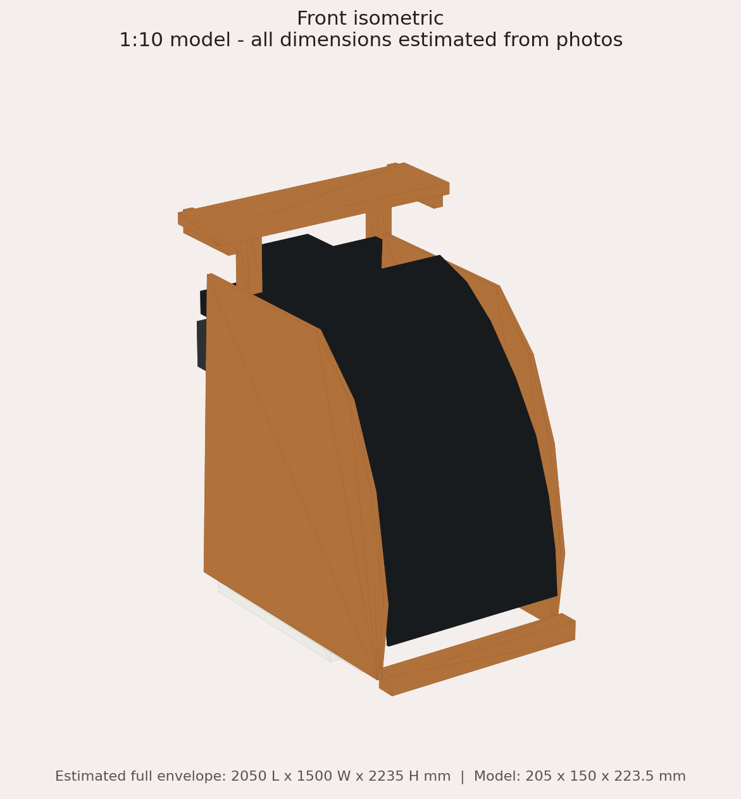
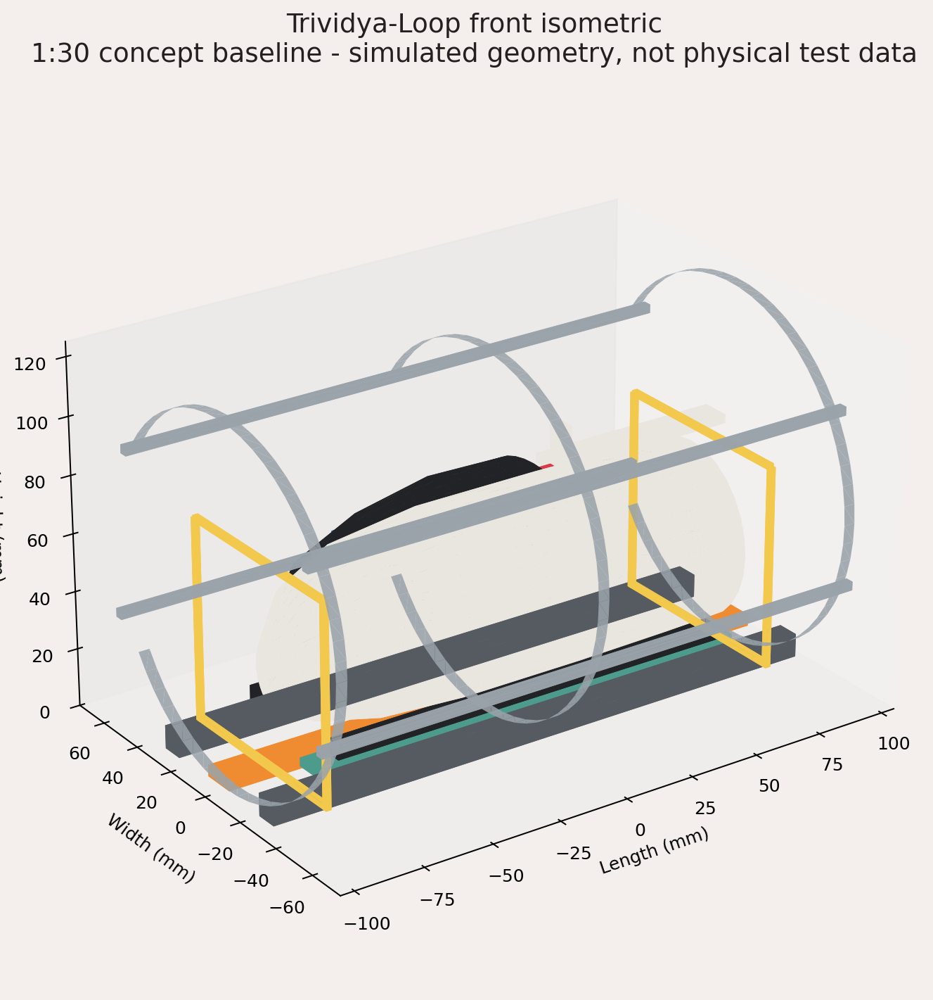
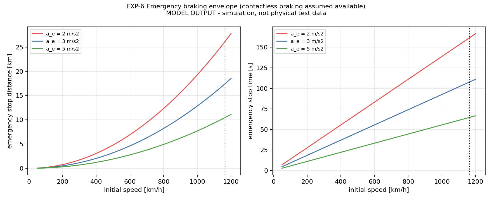

# Trividya-Loop

**A student engineering concept for high-speed emergency patient transport.**

> [!IMPORTANT]
> Trividya-Loop is supported by a person-scale pod mockup, reconstructed drawings, baseline 3D models and exploratory calculations. It is **not** an operational Hyperloop, vacuum transport, levitation or clinical system. Simulation outputs are assumption-driven and are not physical validation.

## Current evidence boundary

| Category | Current evidence |
| --- | --- |
| Demonstrated | A person-scale physical pod mockup exists in the private evidence archive |
| Reconstructed | Photo-estimated mockup geometry, drawing sheets and editable OBJ/STL models |
| Modeled | Route timing, drag/pressure, energy, throughput, thermal, braking and synthetic data-workflow scenarios |
| Proposed | Low-pressure guideway, propulsion/levitation, emergency workflow, sensing and communications |
| Not validated | Full-scale transport, vacuum operation, levitation, clinical safety, regulatory compliance, novelty or real-world performance |

## Reviewed public artifacts

- [2D engineering drawing set (PDF)](drawings/Trividya-engineering-drawings-v1.pdf) and [individual PNG sheets](drawings/png/)
- [Physical mockup reconstruction](models/mockup-reconstruction/) with OBJ/MTL, merged STL, dimensions, renders and explicit photo-estimation limits
- [Assumed 3D system baseline](models/baseline/) with OBJ/MTL, merged STL, renders and open measurements
- [Reproducible assumption-driven simulations](simulations/) with scripts, requirements, CSV/JSON outputs and plots
- [System architecture, pod layout and data workflow](docs/)
- [Provenance and AI-assistance notice](NOTICE.md), [citation metadata](CITATION.cff) and [rights](LICENSE.md)

## Example outputs

| Assumed baseline model | Mockup reconstruction | Assumption-driven plot |
| --- | --- | --- |
|  |  |  |

## Why it exists

Emergency transfers lose time at the boundaries between ambulances, hospitals and transport networks. Trividya-Loop explores what a purpose-built patient pod and controlled guideway might require at system level: patient access, equipment layout, routing, sensing, communications, evacuation, thermal management and safe stopping.

This repository makes the assumptions and reconstruction methods inspectable. It does not present the concept as a finished transport system.

## Reproduce the calculations

See [`simulations/README.md`](simulations/README.md). The committed data and plots are reference outputs from the declared baseline. Results change when assumptions change.

## Next validation steps

1. Freeze a traceable requirements matrix.
2. Measure the physical mockup and replace all `[MEASURE]` values.
3. Build a benchtop guideway and instrument braking repeatability.
4. Measure pod mass, power, thermal load and sensor performance.
5. Run evacuation and loss-of-power failure-mode reviews with qualified reviewers.

## Authorship and AI assistance

The project concept, historical mockup and personal evidence are Mayank Kasana's. AI tools assisted with documentation structure, code cleanup, reconstructed diagrams and editorial review. Reconstructed or AI-assisted artifacts are labeled and are not presented as contemporaneous proof of the original build.

## Links

[Portfolio](https://mayank0996.github.io/) · [Profile](https://github.com/mayank0996)
